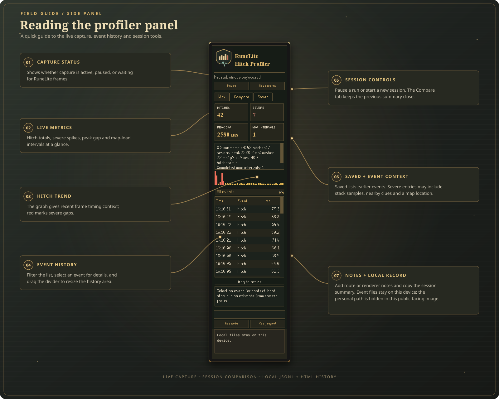
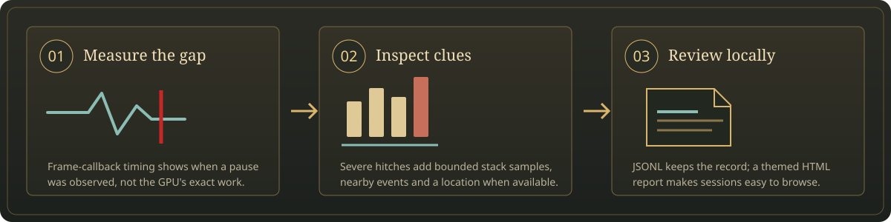
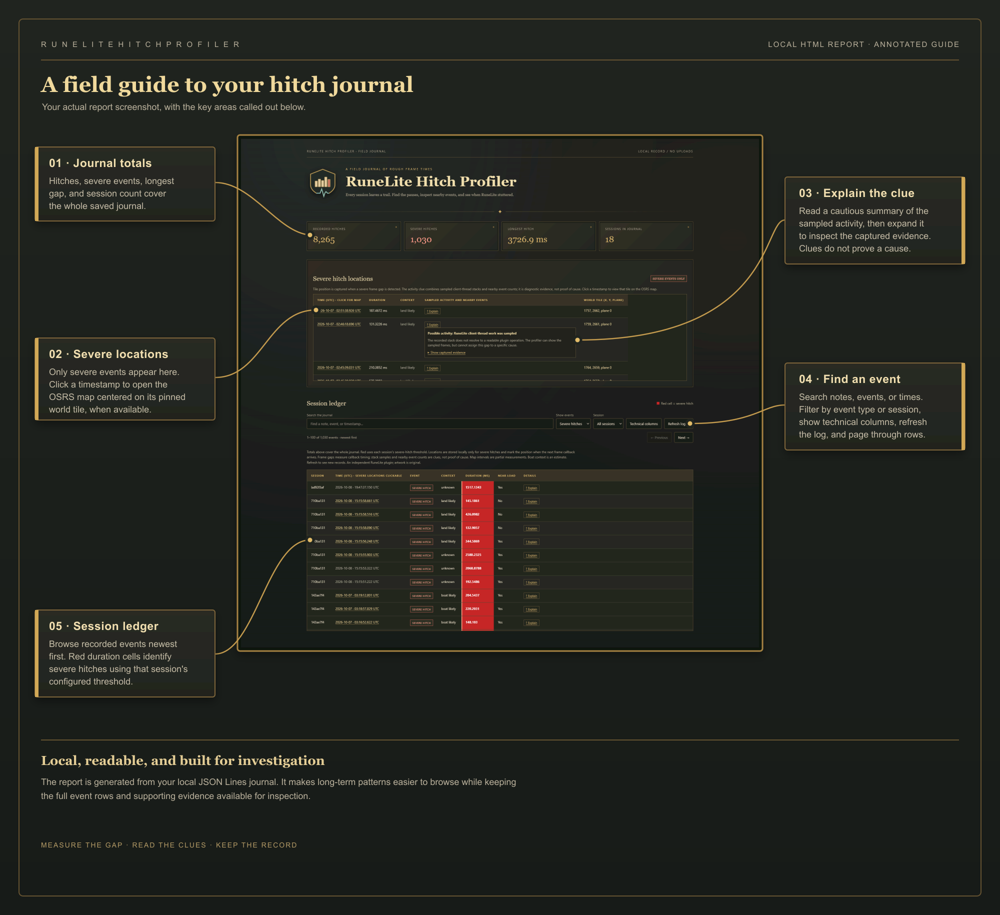

# RuneLite Hitch Profiler

<strong>Find the pauses between frames. Keep the evidence. Compare the run.</strong>

RuneLite Hitch Profiler records frame-time gaps and nearby client activity in a readable side panel and a local HTML report. Use it while travelling, questing, bossing, or comparing graphics settings. It does not change RuneLite's renderer or game settings.

## Side panel guide

The annotated panel below explains the live metrics, hitch graph, event history, session controls, and local notes. The personal file path in the supplied screenshot is hidden in this public-facing graphic.

## Install from the RuneLite Plugin Hub

1. Open the RuneLite client and select **Plugin Hub** from the sidebar.
2. Search for **RuneLite Hitch Profiler** and install it.
3. In the plugin list, enable **RuneLite Hitch Profiler**.
4. Select its shield-and-graph sidebar button to open the profiler.

## Use the profiler

The **Live** tab shows the current session summary, hitch graph, event history, and filters. Select an event to read its context. For a severe hitch, click **?** to switch between a plain-language interpretation and the captured evidence. Use **Pause** to stop recording temporarily, or **New session** to start a fresh run while keeping the previous session available for comparison. Add short notes for route, renderer, and settings so the conditions are recorded with the run.

The **Compare** tab places the current and previous session summaries together. The **Saved** tab lists earlier events from disk. Use **Copy report** to copy the current session summary and logging status. Open the HTML report from the local data folder described below.

### Settings

- **Hitch threshold** — minimum frame gap to record; default **50 ms**.
- **Severe threshold** — marks larger gaps in red and enables severe-event diagnostics; default **150 ms**.
- **Pause when unfocused** — avoids treating RuneLite's background frame limiting as a gameplay hitch; enabled by default.

Threshold changes apply to the next session. Severe events can include bounded client-thread stack samples, nearby event counts, map-loading clues, and a world location when RuneLite provides one. Location is captured only for severe hitches. Boat position is inferred from the camera focus entity; on land it uses the local player's tile.

## What the measurements mean

The profiler measures time between RuneLite frame callbacks. That is useful for finding stalls, but it is not a direct measurement of GPU execution or monitor presentation. Stack samples and nearby events are clues that can help narrow down a hitch; they do not prove a single cause.

The profiler keeps a bounded in-memory event history and appends session records to JSON Lines (JSONL). It refreshes a dark, brass-trimmed HTML report as you play and when the plugin closes. The report includes a severe-location table; clicking a timestamp opens the pinned OSRS map for that event. Map tiles load only when the map is opened.

## HTML report guide

The report turns the local JSONL journal into a searchable field journal. This annotated guide uses the actual report screenshot and points out the journal totals, severe-event map links, evidence explanations, filters, and session ledger.

The totals summarize the full journal. The severe-location table is limited to severe hitches with a captured location; clicking a timestamp opens the map at that event's tile. **Explain** gives a cautious plain-language interpretation and lets you expand the captured evidence. The ledger can be searched and filtered by event type or session, and severe duration cells are red.

## Local data and privacy

Session records and reports stay on your computer; the plugin does not upload them. Opening a map uses external map code and requests map tiles for the selected area, so the map providers receive those requests. The report and hitch journal remain local.

Files are stored in RuneLite's plugin data directory:

- `sailing-hitches.jsonl` — append-only session events.
- `sailing-hitches.html` — readable report generated from those events.

The folder is `~/.runelite/plugin-data/sailing-load-profiler/` (on Windows, `%USERPROFILE%\.runelite\plugin-data\sailing-load-profiler\`). These legacy names are retained so your existing settings and recordings remain available after the project was renamed.

## Roadmap

The severe-hitch translator is available in the side panel and HTML report. It groups common signatures, dynamically names plugin classes present in sampled stacks, and keeps raw evidence available. Its descriptions are cautious observations, not confirmed causes. Future improvements below focus on combining clues across a hitch window, grouping similar events across sessions, and adding supporting measurements.

### First: better evidence for each hitch

| Priority | Improvement | What it would tell you |
| --- | --- | --- |
| 1 | **Profiler overhead and capture health** | Record sampling delays, dropped events, log queue depth, and report-generation time. Benchmark recording with diagnostics off and on, including long sessions, so we know how much work the profiler itself adds. |
| 2 | **Renderer and settings timeline** | Record GPU/117 HD enable and disable events and selected performance settings, where supported. Split comparisons when settings change, so a session containing several renderer configurations is not treated as one result. Use an explicit list of safe settings, not a dump of every plugin's configuration. |
| 3 | **Garbage collection and memory context** | Add low-frequency heap usage, collection-count changes, and collection-time changes around hitches. Show the measurement window: a collection in the same window is a clue, and aggregate collection time is not an exact stop-the-world pause duration. |
| 4 | **Client-thread CPU time versus elapsed time** | Where supported and affordable, compare CPU-time changes with frame-gap duration. This could distinguish CPU-heavy work from an interval containing substantial waiting. Waiting would remain unclassified unless other evidence supports an explanation; it does not by itself prove GPU or buffer trouble. |
| 5 | **A before-and-after hitch timeline** | Keep a bounded rolling buffer of frame timing and nearby events, then retain a short window around severe hitches. Show what happened before, during, and after the gap: loading, entity changes, focus changes, settings changes, and captured stacks. Merge overlapping windows and avoid writing every frame to disk. |
| 6 | **More useful frame statistics** | Add p99 frame time, counts above fixed durations such as 50/100/250/500 ms, severe hitches per active minute, and total time beyond the chosen frame-time budget. Use all captured frame intervals for percentiles; keep hitch-only averages separate. Handle gaps above two seconds without silently treating them as exactly two seconds. |

**Suggested next milestone:** capture health, renderer/settings changes, and memory/GC context. These directly address the uncertainty we encountered when comparing sailing with different renderers. Evaluate CPU-time collection separately before enabling it by default.

### Next: turn recordings into useful comparisons

| Improvement | Planned behavior |
| --- | --- |
| **Repeatable comparison runs** | Name a route or activity, mark its start and finish, and compare several runs under each configuration. Show active duration, sample counts, thresholds, settings differences, and per-run variation. Keep login, warm-up, loading, and unfocused periods identifiable rather than silently mixing them into gameplay results. |
| **Recurring hitch groups** | Group similar stack signatures and event patterns across sessions. Summarize frequency, typical duration, worst duration, and links to examples. Describe a renderer or plugin as appearing in samples; reserve causal claims for stronger evidence. |
| **Richer evidence timelines** | Combine multiple time-bounded clues around each hitch, show their timestamps and confidence limits, and preserve missing or ambiguous evidence instead of forcing a cause category. |
| **Location hotspot map** | Extend the existing severe-event pins into clusters with counts and duration summaries. Keep instance/plane context and explain that raw counts favor places visited more often. Only present hitches per minute at a location if suitable time-spent data is also collected, with a privacy option for location recording. |
| **Scene activity context** | Add bounded summaries of NPC/object churn and available scene counts around hitches. Reuse events or inexpensive snapshots where possible. Avoid full scene scans every frame, and distinguish scene activity from measured rendering cost. |

### Then: make long sessions and sharing easier

- **Session library and report filters:** browse saved runs by date, activity, duration, renderer, and severity; search notes and stacks; open a report from the panel. Load older records in batches and keep the visible table bounded.
- **Log rotation and retention controls:** replace the current 100 MB recording stop with controlled rotation, archive discovery, and a clear disk-use display. Preserve old sessions by default; make any automatic deletion an explicit user choice. Version the data format and keep older recordings readable.
- **Shareable diagnostic bundles:** export selected events, a small report, and relevant environment details. Preview the bundle and remove account names, personal paths, sensitive notes, and optional world locations before sharing. Keep export user-triggered.
- **Capture presets and a manual marker:** offer lightweight everyday capture and a time-limited detailed mode, plus a hotkey to mark a noticeable stutter. Make the capture level visible and cap extra sampling work.

### Measurement rules for future work

- Keep the existing dark journal theme and readable sidebar. Put detail behind event selection rather than crowding the summary.
- Bound memory, sampling, disk queues, and report size. Measure each new feature's overhead before making it part of normal capture.
- Use supported RuneLite APIs and JVM measurements, with an unavailable state when a measurement cannot be collected. Feature feasibility and Plugin Hub review still need checking before implementation.
- Keep timestamped observations separate from explanations. Stack samples, nearby events, and JVM counters can narrow down a hitch without proving a single cause.
- Treat direct GPU execution time, VRAM pressure, driver stalls, and exact buffer-map duration as future integration work requiring suitable renderer instrumentation. Do not infer those measurements from frame gaps alone.
- Verify both logging correctness and gameplay behavior: restart/re-enable, changed thresholds, focus changes, loading, long captures, and renderer comparisons.

Technical references: [Java monitoring and management](https://docs.oracle.com/en/java/javase/11/management/java-se-monitoring-and-management-guide.pdf) and [RuneLite Plugin Hub review scope](https://github.com/runelite/runelite/wiki/Plugin-Hub-Review).

## License

See [LICENSE](LICENSE).
